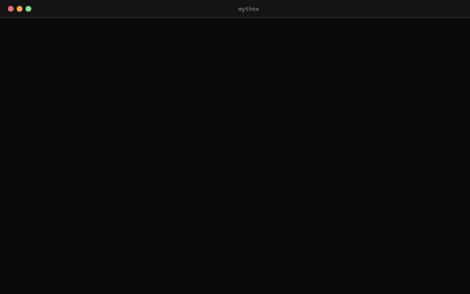
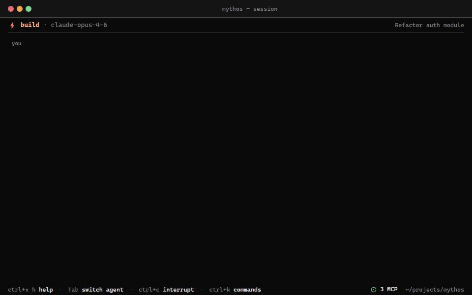
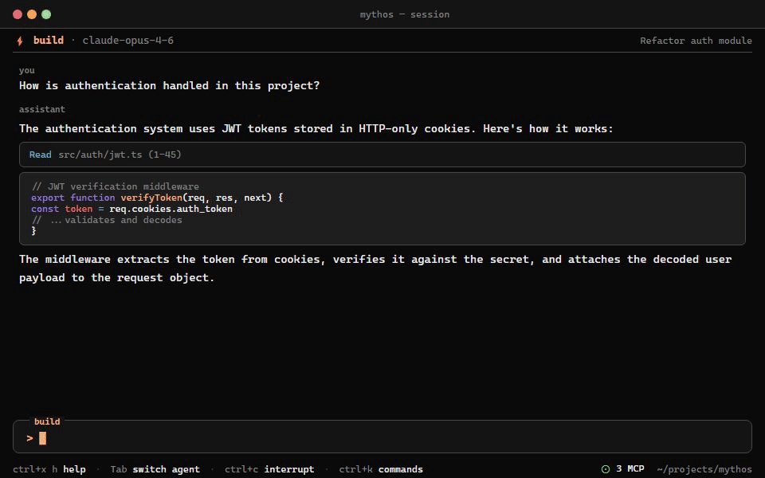

# Mythos CLI

[]()
[](https://bun.sh)
[]()
[]()
[]()
[](https://github.com/warpirate/mythos-code/stargazers)
[](https://github.com/warpirate/mythos-code/network/members)

> **The terminal speaks in tongues.** A buildable, modifiable Claude Code fork with an OpenCode-inspired TUI.

Mythos takes the full Claude Code agentic engine (40+ tools, MCP, memory, skills, multi-agent) and wraps it in a terminal UI inspired by [OpenCode](https://github.com/anomalyco/opencode) — built with React + Ink.

---

## Preview

<p align="center">
  
</p>

<details>
<summary><strong>Theme showcase</strong> — 8 built-in themes (opencode, catppuccin, dracula, tokyonight, gruvbox, solarized, nord)</summary>
<br>
<p align="center">
  
</p>
</details>

<details>
<summary><strong>Interactive session</strong> — streaming responses, tool calls, inline diffs</summary>
<br>
<p align="center">
  
</p>
</details>

<details>
<summary><strong>Sidebar layout</strong> — context tokens, MCP servers, modified files</summary>
<br>
<p align="center">
  
</p>
</details>

---

**[Quick Start](#quick-start)** | **[Features](#features)** | **[Architecture](#architecture-overview)** | **[Theming](#theming)** | **[Keybinds](#keybinds)** | **[Extension Guide](#extension-points)**

---

## Quick Start

### Prerequisites

- [Bun](https://bun.sh) >= 1.3.x
- Valid Anthropic authentication (OAuth via `claude login` or `ANTHROPIC_API_KEY`)

### Install & Run

```bash
git clone https://github.com/warpirate/mythos-code.git
cd mythos-code

# Install dependencies
bun install

# Copy env config
cp .env.example .env

# Run
bun run dev
```

### Run Modes

```bash
# Interactive TUI (default)
bun run dev

# Headless print mode (no TTY needed)
bun src/entrypoints/cli.tsx -p "your prompt here" --output-format text

# JSON output
bun src/entrypoints/cli.tsx -p "your prompt here" --output-format json
```

> **Note**: If `ANTHROPIC_API_KEY` is set in your environment, it must be valid. To use OAuth instead, unset it:
> ```bash
> unset ANTHROPIC_API_KEY
> ```

---

## Features

### OpenCode-Style TUI
- **Split-pane layout** — message area + collapsible sidebar (auto-hides below 120 cols)
- **Header bar** — active agent, model name, session title
- **Footer bar** — keybind hints, MCP server count, working directory
- **Prompt bar** — bordered input with agent label, cursor blinking, `@` file autocomplete, `/` command autocomplete

### 8 Built-in Themes
`opencode` (default dark) · `catppuccin-mocha` · `catppuccin-latte` (light) · `dracula` · `tokyonight` · `gruvbox` · `solarized` · `nord`

### Session Sidebar
- Token usage (context window)
- Running cost
- Current model
- MCP server status (connected/error/connecting)
- Modified files with diff indicators (+/~/-)

### Dialogs
- **Command palette** (`ctrl+k`) — fuzzy search all commands
- **Model selector** — switch models on the fly
- **Theme selector** — live theme switching

### Full Claude Code Engine
- 40+ tools (file read/write/edit, bash, grep, glob, web search, MCP, etc.)
- Multi-agent coordination (build + plan agents, switchable with Tab)
- Persistent memory system (user/feedback/project/reference)
- Skill system with SKILL.md templates
- MCP server management (stdio/http/sse/ws)

---

## Architecture Overview

```
src/
├── entrypoints/cli.tsx   # CLI entrypoint
├── QueryEngine.ts        # Core LLM API engine
├── query.ts              # Agentic loop (async generator)
├── Tool.ts / tools.ts    # Tool types & registry
│
├── components/           # React/Ink TUI (OpenCode-style)
│   ├── Session/          # Header, Footer, Sidebar, MythosChrome
│   ├── Dialogs/          # CommandPalette, ModelSelector, ThemeSelector
│   ├── Home/             # Session list / home screen
│   ├── LogoV2/           # MYTHOS block logo + welcome
│   ├── PromptInput/      # Prompt bar with autocomplete
│   └── shared/           # Spinner, StyledBox, Toast, ToolCallBox
│
├── utils/theme/          # Theme engine (8 themes, custom theme loading)
├── tools/                # 40+ tool implementations
├── services/             # API, MCP, external integrations
├── memdir/               # Persistent memory system
├── skills/               # Skill system
├── coordinator/          # Multi-agent orchestration
└── stubs/                # Stub packages for missing internals
```

### Key Systems

| System | Description |
|--------|-------------|
| **Agentic Loop** | `while(true)` async generator: query → tool calls → results → loop |
| **Memory** | 4-type file-based memory (user/feedback/project/reference) with MEMORY.md index |
| **MCP** | Model Context Protocol server management (stdio/http/sse/ws) |
| **Skills** | Reusable workflow templates (SKILL.md format) |
| **Agents** | Build (full-access) and Plan (read-only), plus custom agents via `.claude/agents/*.md` |
| **Themes** | 8 built-in themes with OpenCode JSON format, custom theme loading |

---

## Theming

Mythos uses the same theme format as OpenCode. Each theme defines a color palette (`defs`) and semantic color mappings (`theme`) with dark/light variants.

### Switch Theme
Use the theme selector dialog or the `/theme` command.

### Custom Themes
Drop a JSON file in any of these locations:
- `~/.config/mythos/theme/*.json`
- `<project-root>/theme/*.json`

Theme JSON format:
```json
{
  "defs": {
    "bg": "#1a1b26",
    "fg": "#c8d3f5",
    "accent": "#82aaff"
  },
  "theme": {
    "primary": { "dark": "accent", "light": "#2e7de9" },
    "background": { "dark": "bg", "light": "#e1e2e7" },
    "text": { "dark": "fg", "light": "#3760bf" }
  }
}
```

---

## Keybinds

### Global
| Key | Action |
|-----|--------|
| `ctrl+c` | Interrupt (double-press to exit) |
| `ctrl+x ctrl+c` | Exit |
| `ctrl+x n` | New session |
| `ctrl+x s` | Session list |
| `ctrl+k` | Command palette |
| `ctrl+x b` | Toggle sidebar |
| `ctrl+x h` | Help dialog |
| `Tab` | Switch agent (build / plan) |

### Prompt
| Key | Action |
|-----|--------|
| `Enter` | Send message |
| `Shift+Enter` | Newline |
| `Up/Down` | Prompt history |
| `Escape` | Clear input |

---

## Extension Points

No source modification needed:

| Mechanism | Location | Format |
|-----------|----------|--------|
| Custom Skills | `.claude/skills/name/SKILL.md` | YAML frontmatter + Markdown |
| Custom Agents | `.claude/agents/name.md` | YAML frontmatter + Markdown |
| MCP Servers | `.mcp.json` | JSON config |
| Hooks | `~/.claude/settings.json` | JSON event-action mappings |
| Custom Themes | `~/.config/mythos/theme/*.json` | OpenCode theme JSON |

---

## Tech Stack

| Layer | Technology |
|-------|-----------|
| Runtime | Bun |
| Language | TypeScript (strict) |
| Terminal UI | React + Ink |
| CLI | Commander.js |
| Validation | Zod v4 |
| Search | ripgrep |
| Protocols | MCP SDK, LSP |
| API | Anthropic SDK |
| Video | Remotion (showcase GIFs) |

---

## Environment Variables

Copy `.env.example` to `.env`:

```bash
cp .env.example .env
```

| Variable | Default | Description |
|----------|---------|-------------|
| `CLAUDE_CODE_DISABLE_EXPERIMENTAL_BETAS` | `1` | Disable upstream experimental flags |
| `DISABLE_INSTALLATION_CHECKS` | `1` | Skip official install channel checks (needed for source builds) |

---

## Disclaimer

- This repository is for **educational and research purposes only**.
- The original Claude Code source is the property of **Anthropic**.
- This repository is **not affiliated with, endorsed by, or maintained by Anthropic**.
- Original source exposure: 2026-03-31 via npm source map leak.

---

If this helps your research, please give it a star!
